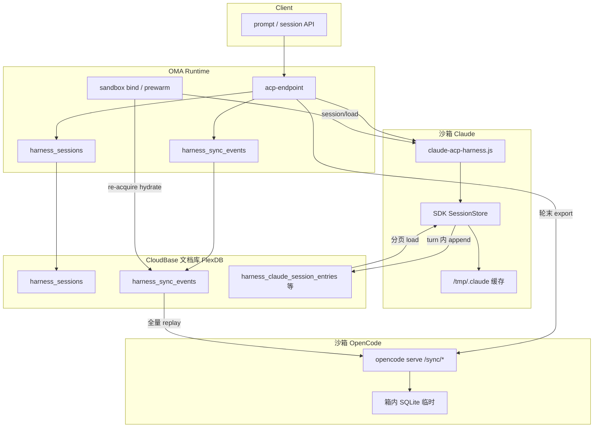

# Harness 会话外置存储

> 读者：架构评审、运维、研发。  
> 关联：[harness-architecture.md](./harness-architecture.md) · [harness-env.md](./harness-env.md)

沙箱内 Agent（`runtime=harness`）的思考与工具在 **AGS 沙箱**里执行；箱内磁盘随实例 TTL 清空。要让对话跨沙箱回收、re-acquire 后仍能续聊，必须把会话「真相」写到箱外。

本文说明 **OpenCode** 与 **Claude Code** 两条链路：写到哪里、何时写、增量还是全量、以及 FlexDB 读写风险。

---

## 1. 总览

| 角色 | 集合 | 谁写入 | 存什么 |
|------|------|--------|--------|
| 共用索引 | `harness_sessions` | **OMA 网关**（CAM） | `acpSessionId` ↔ `engineSessionId`、沙箱 instance 绑定、status；**不含对话正文** |
| OpenCode | `harness_sync_events` | **OMA 网关** | opencode sync 事件（`id` / `seq` / `type` / `data`） |
| Claude | `harness_claude_sessions` | **沙箱内** SessionStore | session 列表索引 |
| Claude | `harness_claude_session_entries` | **沙箱内** SessionStore | transcript entry（append-only） |
| Claude | `harness_claude_session_summaries` | **沙箱内** | 增量 fold 的 summary |
| Claude | `harness_claude_session_messages` | **沙箱内** | 消息元数据（与 entries 双写） |

本地研发若未配置 `TCB_SECRET_*` 或设 `OAK_USE_MEMORY_STORE=1`，OpenCode sync 落 **内存**，不进 FlexDB。

---

## 2. 是否写到 CloudBase FlexDB？

**是。** 两边都通过 `@cloudbase/node-sdk` 的 `app.database().collection(...)` 访问 **CloudBase 文档型数据库**（控制台与文档中常称 FlexDB）。不是 COS，也不是把 SQLite 文件整体上传。

### OpenCode

- 实现：`packages/agent-runtime/src/harness/sync-event-store.ts` → `CloudBaseHarnessSyncEventStore`
- 写库进程：**OMA Runtime**（云函数 / 云托管），使用部署时注入的 `TCB_SECRET_ID` / `TCB_SECRET_KEY`
- 箱内 opencode 只维护本地 SQLite；OMA 在 export 时从箱内 HTTP 拉事件再写入 FlexDB

### Claude Code

- 实现：箱内 `tcb-remote-workspace` 的 `claude-acp-harness.js` + `@cloudbase/open-agent-kernel` 的 `CloudBaseSessionStore`
- 写库进程：**AGS 沙箱内** Claude ACP 进程，凭证由 OMA `buildHarnessInitCredEnv()` 注入（`TENCENTCLOUD_SECRETID` / `TENCENTCLOUD_SECRETKEY`）
- `CLAUDE_CONFIG_DIR=/tmp/.claude` 仅为 SDK 本地缓存，**不是** SoR（Source of Record）

### 与 `TCB_API_KEY` 的区别

| 凭证 | 用途 |
|------|------|
| `TCB_API_KEY` | AGS 沙箱数据面、默认 CloudBase AI LLM |
| `TCB_SECRET_ID` / `TCB_SECRET_KEY`（CAM） | FlexDB 读写（会话外置、托管 Agent 的 `oak_*` 等） |

---

## 3. 写入时机是否合适？

### 3.1 OpenCode — 按「轮次」批量写

| 时机 | 代码路径 | 同步/异步 | 说明 |
|------|----------|-----------|------|
| **每轮 prompt 结束** | `acp-endpoint.ts` → `persistOpencodeSyncForSession` | 异步 | SSE 收尾后 export（含重试）；不阻塞用户收流 |
| **沙箱 idle pause** | `sandbox-prewarm.ts` → `pauseIdleSandbox` | 同步（pause 前） | 长单轮后空闲回收前兜底 export |
| **`session/delete`** | `handleSessionDelete` → `persistOpencodeSyncForSession` | 同步 | 停箱前再 export，并可选 `workspace/snapshot`（COS） |
| **沙箱 re-acquire** | `sandbox-prewarm.ts` → `hydrateOpencodeSyncEvents` | 同步（读路径） | 从 FlexDB **读** → replay 进新箱；此阶段不写 FlexDB |
| **prompt 进行中** | — | — | **不写** FlexDB |

**优点：** 每轮最多一次 export 写放大，逻辑简单，不跟 token 流绑死。

**缺口：** 若沙箱在**一轮对话中途**崩溃（AGS 强杀、OOM），且上一轮 export 之后产生的新事件**尚未落盘**，则这段对话会丢。当前没有「轮中 checkpoint」。

Export 细节（`opencode-sync.ts`）：

1. 查 FlexDB 已有 `maxSeq` 作 cursor  
2. `POST` 箱内 `/sync/history` 只拉 **cursor 之后** 的事件  
3. 按 event `id` 幂等写入 `harness_sync_events`

### 3.2 Claude Code — SDK 在 turn 内增量写

| 时机 | 说明 |
|------|------|
| **SDK 处理 turn 时** | `claude-agent-sdk` 调用 `SessionStore.append()`，**边生成边写** FlexDB |
| **re-acquire** | OMA `claude-session-warm.ts` 调箱内 `session/load`（`replay: false`），SDK 从 Store **load** 恢复 |
| **OMA 网关** | **不参与** transcript 写库 |

比 OpenCode **更实时**：已 `append` 的 entry 在箱挂后仍可被下一只沙箱 load 回来。

注意：架构简图里写「prompt 结束 → SessionStore」不准确；准确说法是 **「SDK turn 处理过程中 append」**。

---

## 4. 全量还是增量？

### 4.1 OpenCode

| 操作 | 粒度 | 说明 |
|------|------|------|
| **export（写 FlexDB）** | **增量** | cursor = 已有 `maxSeq`；只 append 新 event；`doc(ev.id)` 已存在则跳过 |
| **hydrate（读 FlexDB → 写箱）** | **对该会话全量** | `listEventsForAggregate` 取出该 `aggregateId` 下事件（当前单次查询 `limit(5000)`），整包 `POST /sync/replay` |

持久化是 **事件溯源式追加**；恢复是 **（有上限的）全量 replay**。

### 4.2 Claude Code

| 操作 | 粒度 | 说明 |
|------|------|------|
| **append（写 FlexDB）** | **增量** | append-only；entry `uuid` 幂等；单次 append 通常 1–3 条 |
| **load（读 FlexDB）** | **对该会话全量** | 按 `sessionKey` 分页（每页 100 条）直到读完 |

不是每轮重写整段 JSON；是 **逐条追加**。但 `session/load` 仍要读回该会话已有全部 entry。

### 4.3 `harness_sessions`

始终 **单行 upsert**（元数据），体积与对话长度无关。

---

## 5. 会不会打爆 FlexDB / 类似 DDoS？

### 5.1 不是哪种风险

- **不是**公网匿名任意写 FlexDB：写库要 CAM 或已注入沙箱的 `TENCENTCLOUD_*`  
- **不是**每个 SSE token 一次 FlexDB 写（OpenCode 按轮；Claude 按 SDK append 批次，不是 per-token）  
- **没有**后台定时轮询 export 打 DB  

### 5.2 真实压力来源

| 来源 | 机制 | 何时变严重 |
|------|------|------------|
| OpenCode 每轮 export | 1 次箱内 HTTP + 每条新事件 FlexDB 写 | 高频短 prompt、多 tool 轮次 |
| OpenCode `maxSeq` 查询 | `orderBy seq desc limit 1`（O(1) 读） | 已加固 |
| OpenCode hydrate | 分页读全量（100 条/页）+ replay | 极长会话 re-acquire 仍有一次性读放大 |
| Claude append | 每次 append：查重 + 逐条 `add` + messages 双写 + summary | 长回复、多 step 的 turn |
| Claude load | 分页读全会话 | 长会话 + 频繁 re-acquire |
| 多会话并发 | 各会话独立集合行 | 同一 env 多租户 / 高并发 |

### 5.3 和「DDoS」的关系

| 问题 | 结论 |
|------|------|
| 外部 DDoS 打我们 FlexDB？ | **否**（需合法凭证与沙箱） |
| 恶意或失控租户刷会话打满配额？ | **可能** → 需 CloudBase 配额 + 产品侧并发/限流 |
| 正常单用户长聊误伤？ | **低**；需关注 §6 中的实现级热点 |

---

## 6. 已实施的加固（OpenCode）

| # | 项 | 实现 |
|---|-----|------|
| 1 | `maxSeq` O(1) 读 | `CloudBaseHarnessSyncEventStore.maxSeqForAggregate` → `orderBy("seq","desc").limit(1)` |
| 2 | hydrate 无 5000 截断 | `listEventsForAggregate` 按 `seq` 游标分页（`HARNESS_SYNC_EVENTS_PAGE_SIZE=100`） |
| 3 | idle pause 前 export | `sandbox-prewarm.ts` → `pauseIdleSandbox` 在 `pause()` 前调 `persistOpencodeSyncForSession` |
| 4 | export 重试 + 可观测 | `opencode-sync.ts` → `persistOpencodeSyncForSession`：退避 0/500/1500ms 共 3 次；失败写 `harness_sessions.syncExportFailedAt` |
| 5 | `appendEvents` 批量查重 | `fetchExistingIds`：`id in (...)` 每批 20，再 `doc(id).set` |

统一入口：`persistOpencodeSyncForSession({ acpSessionId, config, reason })`，`reason` 为 `prompt_end` | `idle_pause` | `session_delete`。

运维：对 `harness_sessions` 查 `syncExportFailedAt != null` 可发现 export 连续失败会话；日志 lane `opencode_sync`、operation `persist`。

---

## 7. 后续可选（未做）

### Claude：长会话 load 监控与上限说明

**现象：** `session/load` 从 FlexDB 分页读 **全会话** entry；超长会话 re-acquire 慢。逻辑在 vendored `@cloudbase/open-agent-kernel`，不宜在 TRW 里硬改。

**改法（产品/运维向）：**

1. 在 e2e / 运维脚本用现有 `countHarnessClaudeSessionEntries` 打指标。  
2. 文档写明：单会话 entry 建议 < 几千；超限考虑新开会话。  
3. 若必须工程化：在 OAK 提 PR 支持 `load` 游标或 summary-only 快速路径（工作量大，非 harness 单点能完成）。

**工作量：** 文档 + 指标为小；OAK 改动为大。  
**暂不推荐：** 在 harness 层 duplicate 一套 SessionStore。

---

### 不建议现在做

| 想法 | 原因 |
|------|------|
| 每个 SSE chunk / tool 帧 export | 写放大一个数量级，FlexDB 压力反而更大 |
| 把 transcript 改存 COS 大对象 | 架构变动大，丧失按 event 幂等与查询能力 |
| 轮中每个 tool 后 export | 需改 ACP 流解析，写放大高 |

---

## 8. 代码索引

| 主题 | 路径 |
|------|------|
| OpenCode export / hydrate / persist | `packages/agent-runtime/src/harness/opencode-sync.ts` |
| FlexDB sync 集合 | `packages/agent-runtime/src/harness/sync-event-store.ts` |
| 轮末 / delete 触发 | `packages/agent-runtime/src/harness/acp-endpoint.ts` |
| re-acquire hydrate | `packages/agent-runtime/src/harness/sandbox/sandbox-prewarm.ts` |
| 会话索引 | `packages/agent-runtime/src/harness/sandbox/session-store.ts` |
| Claude 箱内 Store | `tcb-remote-workspace/src/harness/claude-session-store.ts` |
| Claude warm load | `packages/agent-runtime/src/harness/claude-session-warm.ts` |
| OAK SessionStore 实现 | `tcb-remote-workspace/vendor/cloudbase-open-agent-kernel-*.tgz` → `session-store/` |

---

## 9. 相关文档

- [harness-architecture.md](./harness-architecture.md) — 运行时总架构  
- [harness-opencode.md](./harness-opencode.md) — OpenCode 对客配置  
- [harness-claude-code.md](./harness-claude-code.md) — Claude 对客配置  
- [harness-env.md](./harness-env.md) — `TCB_SECRET_*` 与 `.env.harness`
