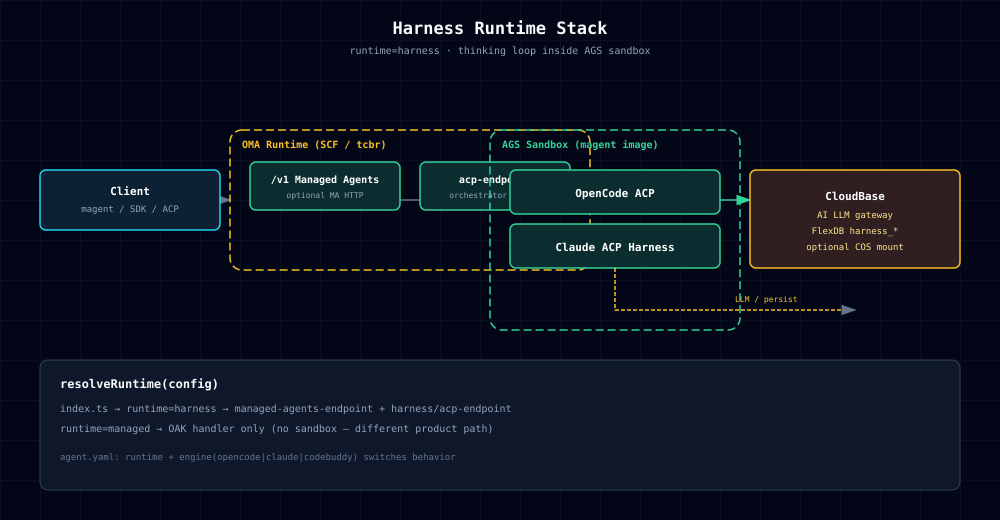
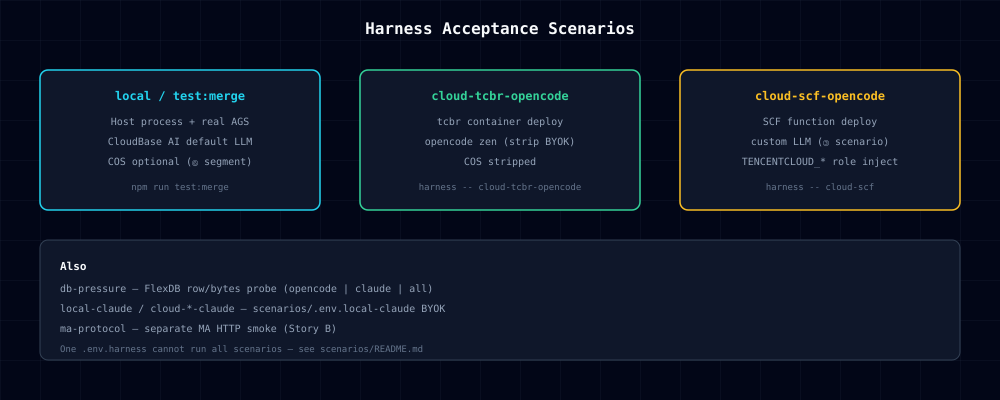
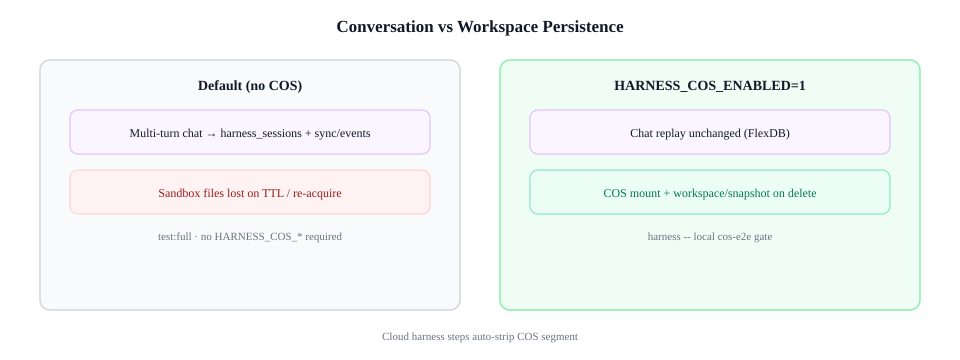
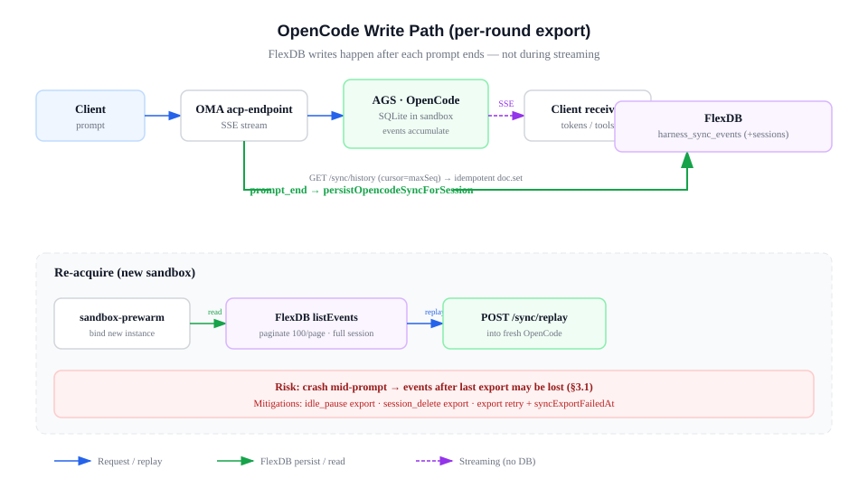
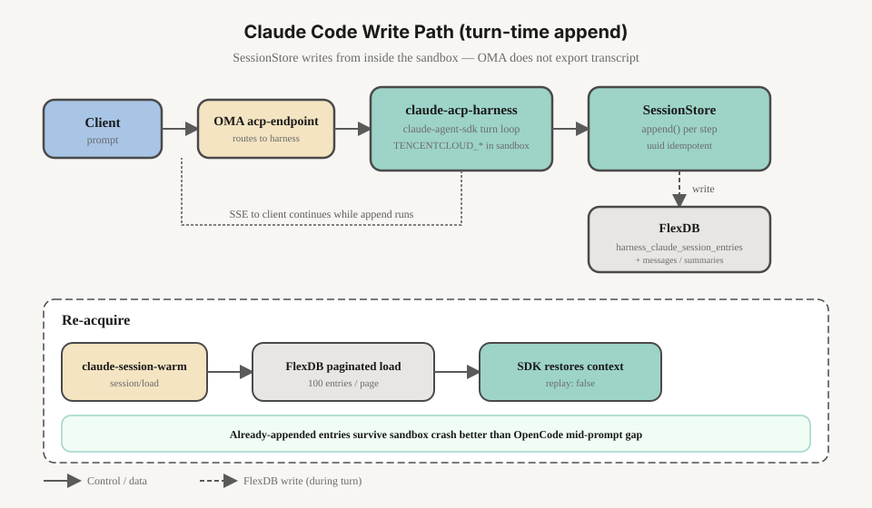

# 沙箱内 Agent — 架构参考（维护者专用）

> **用户文档：** [使用指南](./harness-tutorial.md) · [凭证说明](./harness-credentials.md) · [用户故事](./harness-user-story.md)  
> 本文描述运行时架构、日志与仓库内验收；**不对客**。

环境变量：[harness-env.md](./harness-env.md) · 会话外置：[harness-agent-session-storage.md](./harness-agent-session-storage.md)  
验收编排：[CONTRIBUTING.md](../CONTRIBUTING.md) · [scenarios/README.md](../scripts/harness/scenarios/README.md)

`runtime=harness`：思考循环在 **AGS 沙箱内 engine**（opencode / claude / codebuddy）跑 ACP；OMA Runtime 负责会话索引、sync、client tool 桥、MCP relay。



> 图源：`docs/diagrams/` · 重生成：`python3 docs/diagrams/generate-harness-diagrams.py`

---

## 1. 入口

### 1.1 配置与 CLI

```yaml
runtime: harness
engine: opencode
```

```bash
# 先 magent login && tcb env use <envId>（-e 可省略）
magent agent:create -n MyAgent --runtime harness --engine opencode -f agent.yaml
magent agent:update -i "$AGENT_ID" --agent-runtime harness --engine opencode -f agent.yaml
```

云上进程读 `AGENT_CONFIG` → `resolveRuntime()` → `runtime=harness`。支持 SCF、tcbr、scf-image。

### 1.2 代码路径

```text
index.ts → resolveRuntime(config)
  harness → managed-agents/managed-agents-endpoint.ts（/v1/* Managed Agents HTTP）
         → harness/acp-endpoint.ts → orchestrator / sync / 箱内 ACP
  managed → OAK handler

同一 agent-runtime 包；`agent.yaml` 的 `runtime` 字段切换行为。
```

Managed Agents 面详见 [managed-agents-http.md](./managed-agents-http.md)。

### 1.2.1 CLI / Runtime 拆分规则（编码器 / 解码器分离）

> 上游 refactor（`47fa247`）将 CLI 从 `agent-runtime` npm 依赖中解耦。harness 链路须遵守同一规则。

**原则：CLI（编码器）和 runtime（解码器）仅通过 env / yaml 通信，不通过代码 import。**

| 侧 | 职责 | 位置 | kernel 依赖 |
|----|------|------|------------|
| **编码器**（CLI / 部署时） | 解析 flags → 构建配置 → 生成 env map → `magent agent:create/update` | `lib/harness-deploy.mjs`（纯 JS） | 无 |
| **解码器**（Runtime / 运行时） | 读 `AGENT_CONFIG` / env → 构建箱内环境 → ACP / sync / store | `packages/agent-runtime/src/harness/`（TS） | 有 |

**已移出 agent-runtime 的函数**（部署时在操作者机器上跑，不进入云上容器）：

- `normalizeAgentRuntime` — flag → config runtime/engine 归一化
- `agentLoopRuntimeFromArgs` — `--agent-runtime` / `--runtime` flag 解析
- `applyHarnessRuntimeEnv` — 合并 harness env 到 SCF / CloudRun env map
- `forwardHarnessDeployEnv` — 转发 `HARNESS_*` / `LLM_*` / `TCB_*` 到容器 env
- `HARNESS_DEPLOY_ENV_KEYS` — 需转发的 env key 列表

以上函数现位于 `lib/harness-deploy.mjs`，不再从 `packages/agent-runtime/dist` 导出。

**留在 agent-runtime 的函数**（运行时在沙箱 / 网关内跑）：

- `buildHarnessOpencodeConfigContent` / `buildHarnessSandboxEnv` — 箱内 env 构建
- `buildMcporterConfig` / `buildHarnessAcpMcpServers` — MCP 配置
- `getHarnessSessionStore` / `getHarnessSyncEventStore` — FlexDB session 存储
- `probeCloudBasePlatformLlm` / `probeHarnessOpenAiLlm` — LLM 探活（运行时侧，因为需要与 runtime 共享 LLM provider 解析逻辑）
- `resolveCamControlPlaneCredentials` / `HARNESS_PUBLIC_MAGENT_IMAGE` — 运行时常量

**故意重复的函数**（两侧各一份，不共享）：

`buildMcporterConfig`、`resolveRuntime`、`getCustomTools`、`normalizeAgentConfig`、`resolveSandboxConfig`、`normalizeSandboxEnv` — CLI 侧是纯 JS / 无 kernel，runtime 侧是 TS + kernel 类型。**不要试图共享**，那会重新引入依赖。

**harness 验收脚本（`scripts/harness/`）的导入规则**：

- ✅ 从 `dist/` 导入 runtime 侧函数（store、orchestrator、probe、harness-env 常量）— 这些是运行时 / 验证时用的
- ❌ 不要从 `dist/` 导入已移出的编码器函数 — 从 `lib/harness-deploy.mjs` 导入
- ✅ `tests/harness/unit.test.mjs` 测试编码器函数时，从 `lib/harness-deploy.mjs` 导入

### 1.3 研发验收路由

```bash
cp .env.harness.example .env.harness
node scripts/harness/load-env.mjs --check
```

| 场景 | 命令 |
|------|------|
| 合入 / 日常 | `npm run test:merge` |
| 云上 opencode | `npm run harness -- run --infra tcbr,scf --engine opencode` |
| 发版编排 | `npm run harness -- release --profile cloud` |

详见 [CONTRIBUTING.md](../CONTRIBUTING.md)。

```bash
# 日常
npm run test:merge
npm run harness -- run --infra tcbr,scf --engine opencode

# 发版前
npm run harness -- release --profile delivery
```

| 命令 | 部署形态 | 范围 |
|------|----------|------|
| `harness -- run --infra local` | 本机进程 + 真 AGS |
| `harness -- run --infra tcbr` | tcbr 云托管 |
| `harness -- run --infra scf` | SCF 云函数 |

Pin：`.env.harness` 中 `HARNESS_CLOUD_TCBR_OPENCODE_AGENT_ID`、`HARNESS_CLOUD_SCF_OPENCODE_AGENT_ID` 等（见 `harness-env.md`）。



---

## 2. 验收脚本

```bash
npm run test:merge
npm run harness -- run --infra tcbr --engine opencode [--agent-id …] [--verify-only]
npm run harness -- run --infra scf --engine opencode [--agent-id …] [--verify-only]

node scripts/harness/load-env.mjs --check [--probe-llm]
node scripts/harness/ags-teardown.mjs
node scripts/harness/cos-probe.mjs
./scripts/harness/build-push-magent-public.sh
node tests/harness/hitl-opencode.test.mjs
node scripts/harness/acp-bridge.mjs [baseURL]
```

### 沙箱镜像

| 项 | 要求 |
|----|------|
| opencode | ≥ 1.16.2 |
| 箱内进程 | `opencode acp`（`ENABLE_AGENT_OPENCODE_SERVE` 时含 sync） |

```bash
# 维护者：在 magent 镜像源码仓库 build 后，于本仓库发版
./scripts/harness/build-push-magent-public.sh
```

tool update 后约 **120s** 再 start。

### COS（可选 — 工作区跨沙箱）

**默认不启用**：对话连续性靠 `harness_sync_events`（opencode sync replay）；沙箱本地磁盘随 AGS 实例 TTL 清空，属设计预期。



**启用 COS**（`.env.harness` ⑥ 段）：AGS 挂载 COS 工作区，`session/delete` 时 `workspace/snapshot` → **跨沙箱 / re-acquire 保留文件现场**（与对话 replay 互补）。

- **local 矩阵 full e2e 不挂 COS**；`.env.harness` 里 `HARNESS_COS_ENABLED=1` 只触发 **`run --infra local` 末尾 cos-e2e**
- **cloud**：`run --infra tcbr|scf … --with-cos`（tool 名仍 `oma-harness-{env}`）
- `loadEnv()` 默认不注入 COS 键；见 [scenarios/README.md](../scripts/harness/scenarios/README.md#cos-三态)

`.env.harness` 配齐 ⑥ 段后 → `cos-probe.mjs` 或 `run --infra local`（含 cos-e2e）。

---

## 3. 数据与隔离

| 资源 | harness |
|------|---------|
| 会话索引 | `harness_sessions` |
| 对话 replay | `harness_sync_events` |
| healthz | `harnessStore` |

| 机制 | 说明 |
|------|------|
| `runtime=harness` | 开关 |
| Collection | `harness_*` |
| `HARNESS_*` / `.env.harness` | 研发 Harness 专用 env（单文件） |

代码：`packages/agent-runtime/src/harness/` · `scripts/harness/` · `tests/harness/`

---

## 4. 默认 LLM（平台）

| 条件 | 行为 |
|------|------|
| `CLOUDBASE_APIKEY` + `CLOUDBASE_ENV_ID`，未配自定义 LLM | CloudBase AI `hy3-preview`（OpenAI / Anthropic 同一 gateway） |
| `model: zen`（仅 opencode） | 箱内内置 zen，不走 CloudBase AI |
| 自定义 `LLM_*` 或 ModelSpec | 第三方 provider |

对客说明：[harness-opencode.md](./harness-opencode.md) · [harness-claude-code.md](./harness-claude-code.md)

---

## 4a. OpenCode sync（`engine=opencode`）



`harness_sessions`：`acpSessionId` ↔ `engineSessionId`。对话记录在 `harness_sync_events`（event `id` 幂等）。

详见 [harness-agent-session-storage.md](./harness-agent-session-storage.md)。

---

## 4b. Claude SessionStore（`engine=claude`）



箱内进程：`claude-acp-harness.js`（`HARNESS_CLAUDE_SESSION_STORE=1`）。详见 [harness-agent-session-storage.md](./harness-agent-session-storage.md)。

| 项 | 说明 |
|----|------|
| SoR | CloudBase `harness_claude_*`（非 `/tmp/.claude`） |
| 箱内 config | `CLAUDE_CONFIG_DIR=/tmp/.claude`（ephemeral，仅 SDK 本地缓存） |
| LLM | 默认 `CLOUDBASE_APIKEY` → CloudBase AI；自定义时宿主机 `LLM_*` → 箱内 `ANTHROPIC_*` |
| 镜像 | magent 须含 `dist/agents/claude-acp-harness.js` + `@cloudbase/open-agent-kernel` |

OMA re-acquire 后 `claude-session-warm.ts` 调箱内 `session/load`（`replay:false`），与 opencode 的 `harness_sync_events` replay 互补。

---

## 5. 能力清单

| # | 能力 | 实现 | 验收 |
|---|------|------|------|
| 1 | 网关聊天、流式 | 箱内 engine ACP + 转发 | local e2e + cloud prompt |
| 2 | magent + agent.yaml | `runtime` / `engine` | cloud deploy |
| 3 | 远程工作区 | `AgsStatefulSandboxOrchestrator` | full e2e |
| 4 | 写文件、跑命令 | 沙箱 tools | matrix |
| 5 | client custom tool | MCP `managed-agent-client` | e2e |
| 6 | session list/load/delete | `harness_sessions` + sync | e2e lifecycle |
| 7 | HITL / 审批 | engine → 网关透传 | stub e2e；真箱手动 |
| 8 | 外部 MCP | mcporter | matrix #8 |
| 9 | CloudBase 箱内 MCP | `workspace/init` | matrix #9 |
| 10 | Skills | `.agents/skills/` | matrix #10 |
| 11 | 模型与密钥 | `CLOUDBASE_APIKEY` + 默认 `hy3-preview`；可选 zen / BYOK | local + cloud probe |

---

## 6. 排障

完整说明：[harness-observability.md](./harness-observability.md)

| 层 | 日志位置 | 关联字段 |
|----|----------|----------|
| OMA Runtime | tcbr/SCF **stdout**（`harnessLog` / evlog） | `traceId`, `spanId`, `requestId`, `acpSessionId`, `instanceId`, `lane`, `phase` |
| 沙箱数据面 | `/var/log/trw/*.jsonl` + stdout | `trace_id`, `request_id`, `harness_acp_session_id`, `event=access\|tool_call` |
| opencode | stderr → 箱内 `agent_stderr` | `agent=opencode-acp` |
| CloudBase 控制台 | [服务调用日志](https://docs.cloudbase.net/logger/tracelog) | `traceId`（`traceparent` 或 `x-cloudbase-trace`） |

**关联策略（Runtime ↔ 沙箱数据面）**：入站优先 `traceparent`，其次 `x-cloudbase-trace`；request 侧 `x-cloudbase-request-id` > `x-scf-request-id` > `x-request-id` > `x-trace-id`；非法则丢弃。无入站 `requestId` 时本进程生成 UUID。会话级用已有 `acpSessionId` / `HARNESS_ACP_SESSION_ID`（不新造 env）。向沙箱数据面仅透传 `traceparent`（或 `x-cloudbase-trace` + 合成 traceparent）与 `X-Request-Id`；**禁止**伪造 `X-Scf-*`。

```bash
# 云上（控制台服务调用日志）
traceId:8f431b7e-bfcc-423e-99d8-cda72471ff49

# OMA Runtime（SCF / tcbr stdout）
tcb fn log <agent-id> -e "$CLOUDBASE_ENV_ID" | rg 'traceId|spanId|requestId|acpSessionId'

# 沙箱实例内（经网关进箱后）
sudo tail -n 200 /var/log/trw/*.jsonl | rg 'trace_id|request_id|harness_acp_session_id'

# 本地
LOG_LEVEL=debug npm run harness -- run --infra local --engine opencode
curl -s localhost:9000/healthz | jq '{sandbox, telemetry}'
```

云上 orchestrator **里程碑**（`milestone` → info）：`tool.ensure` / `cos.ensure_subpath` / `instance_start` / `token.acquire`。`session/new` 结束打 `instanceId` + `durationMs`。

| 现象 | 处理 |
|------|------|
| `/sync/history` 恒 `[]` | opencode ≥ 1.16.2 |
| create 后 `magent run` 404 | 等待 gateway 路由；cloud 脚本 poll ACP |
| cloud prompt 504 | prewarm / 网关限时 |
| custom LLM 401/429 | 检查 key 与区划 |
| SCF `cos.ensure_subpath` InvalidAccessKeyId | 角色 `TENCENTCLOUD_*` + SessionToken；函数 env 勿 forward `TCB_SECRET_*` |
| cloud-scf HTTP 435 | SCF 函数 Deleting；等 90s 或 pin `HARNESS_CLOUD_SCF_AGENT_ID` |
| tool/常量镜像 tag 不一致 | `load-env.mjs --check` → `sync-tool.mjs` → 等 ~120s |
| `StorageMount` / `MountOption` | local 矩阵不挂 COS；cos-e2e 需 tool 带 mount（无则删 tool 重建） |
| shell `export HARNESS_TOOL_ID` | 只写 `.env.harness`；`load-env` 清泄漏 |
| platform preflight 429 | local opencode → zen fallback（仅测试） |
| product-acceptance FlexDB 配额 | `OAK_USE_MEMORY_STORE=1` 或错峰；见 [harness-ops-notes.md](./harness-ops-notes.md) |

OpenCode 箱内路径：`/home/user/.opencode` · `OPENCODE_CONFIG_CONTENT` · `~/.local/share/opencode/auth.json`

---

## 7. 文档

| 文档 | 内容 |
|------|------|
| [harness-tutorial.md](./harness-tutorial.md) | 对客上手 |
| [harness-env.md](./harness-env.md) | 环境变量 |
| [CONTRIBUTING.md](../CONTRIBUTING.md) | 验收两轴 · release |
| [harness-observability.md](./harness-observability.md) | 日志 · traceparent · 可选 OTEL |
| [harness-ops-notes.md](./harness-ops-notes.md) | 运维备忘（丢话、副本、db-pressure） |
| [harness-agent-session-storage.md](./harness-agent-session-storage.md) | 会话外置 · FlexDB 压测 |
| [product-guide.md](./product-guide.md) | 托管 Agent |

图示目录：`docs/diagrams/harness-*.svg`（`generate-harness-diagrams.py` 统一生成）。
