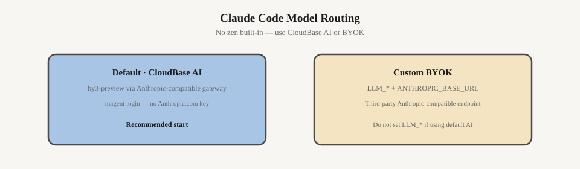

# 沙箱内 Agent — Claude Code

箱内 **Claude Code** 引擎（`engine: claude`）。通用流程见 [使用指南](./harness-tutorial.md)。完整字段见 **`agent.harness.yaml.example`**。

> Claude Code 不支持 `zen`；起步请用 CloudBase AI 默认模型或下方自有模型配置。

---

## 快速开始

```bash
magent login
tcb env use your-env-id
cp agent.harness.yaml.example agent.harness.yaml
# 编辑 engine: claude
```

```bash
magent agent:create \
  --name "my-claude-sandbox" \
  --runtime harness \
  --engine claude \
  --file ./agent.harness.yaml \
  --code ./packages/agent-runtime

magent run -a "$CLOUDBASE_AGENT_ID" \
  -m "列出当前工作目录下的文件。"
```

`magent login` 后自动鉴权，调用 **CloudBase AI**（[Anthropic Messages 兼容网关](https://docs.cloudbase.net/ai/model/anthropic-sdk-access)，默认 `hy3-preview`）。无需另行配置第三方 Key。

---

## 模型



Claude Code 使用 **Anthropic Messages 兼容** API。在根字段 `model` 中配置。

| 方式 | yaml | 说明 |
|------|------|------|
| **平台 AI（推荐）** | 省略 `model` 或 `model: hy3-preview` | CloudBase AI |
| **自有模型** | 见下节 | Anthropic 兼容 endpoint + 自有 Key |

`engine: claude` 时，`apiBaseUrl` 须为 **Anthropic Messages 兼容** 地址，不能填 OpenAI Chat Completions 地址。

---

## 自定义模型（Anthropic 兼容）

在 `agent.harness.yaml` 中配置：

```yaml
engine: claude
model:
  id: <模型 ID>
  apiKey: <API Key>
  apiBaseUrl: https://<你的域名>/anthropic
```

仍使用 CloudBase AI 时，不要填写 `apiKey` 或非平台的 `apiBaseUrl`。

---

## 其它能力

工具、MCP、Skills、COS、镜像见 [使用指南](./harness-tutorial.md)。

---

## 常见问题

| 现象 | 处理 |
|------|------|
| 鉴权失败 | `magent login` + `tcb env use`；CI 见 [凭证说明](./harness-credentials.md) |
| 想用 OpenCode / zen | [harness-opencode.md](./harness-opencode.md) |
| 沙箱无法启动 | [使用指南 · 部署前检查](./harness-tutorial.md#第-1-步部署前检查推荐) |

---

## 相关文档

- [使用指南](./harness-tutorial.md)
- [OpenCode](./harness-opencode.md)
- [配置模板](../agent.harness.yaml.example)
