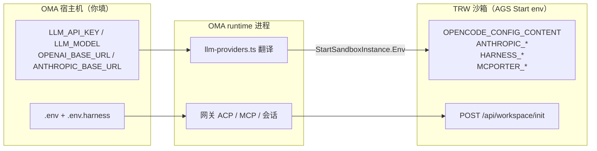

# Harness 环境变量

OMA harness 本地一条龙（`runtime=harness`）用到的 env，按**谁读、谁填**分层说明。

## 三层模型



| 层 | 配置文件 | 作用 |
|----|----------|------|
| **宿主机** | `.env`、`.env.harness` | CloudBase 控制面 + LLM 凭证；`node scripts/load-env.mjs` 加载 |
| **OMA runtime** | 进程 env（测试/部署注入） | 薄网关：`PORT`、`CLOUDBASE_SERVER_URL`、`AGENT_CONFIG` 等 |
| **TRW 沙箱** | AGS `StartSandboxInstance.Env` + workspace API | 箱内 opencode / claude / relay；**键名由 TRW 规范定义** |

**原则：** 你在 OMA example 里只填宿主机层；OMA 代码把 LLM 翻成 TRW 认识的 `OPENCODE_CONFIG_CONTENT` / `ANTHROPIC_*`，不要把沙箱内键抄进 example 让人手填。

---

## 文件加载

```bash
cp .env.example .env
cp .env.harness.example .env.harness
```

`scripts/load-env.mjs`：先 `.env`，再 **整文件覆盖** `.env.harness`（harness 优先）。

别名（仅 load 时）：`TCB_ENV_ID`→`CLOUDBASE_ENV_ID`，`TENCENTCLOUD_SECRETID`→`TCB_SECRET_ID` 等。

检查：

```bash
node scripts/load-env.mjs --check
```

---

## `.env`（与 master 对齐，CloudBase 控制面）

| 变量 | 必填（真 AGS） | 说明 |
|------|----------------|------|
| `CLOUDBASE_ENV_ID` | ✓ | 环境 ID |
| `TCB_REGION` | ✓（真 AGS / CloudBase DB） | 如 `ap-shanghai` |
| `TCB_API_KEY` | ✓ | AGS / SDK JWT |
| `TCB_SECRET_ID` / `TCB_SECRET_KEY` | ✓ | 腾讯云密钥 |
| `CLOUDBASE_ACCESS_KEY` | 部署/网关 | API Key JWT |
| `CLOUDBASE_AGENT_ID` | 可选 | 默认 Agent |

**`.env.example` 已含 `TCB_REGION`**（与 master 对齐）：真 AGS / CloudBase `harness_sessions` / `harness_sync_events` / COS SDK **都读 region**。本地纯 stub e2e（`OAK_USE_MEMORY_STORE=1`）可不填，但 `node scripts/load-env.mjs --check` 与 `harness -- local` 的 full 段会要求。

**不要**往 example 加：`PORT`、`CLOUDBASE_SERVER_URL`（本地 runtime 有默认）、各类 `HARNESS_*` 镜像/COS 细项（放 `.env.harness`）。

---

## `.env.harness`（本地 harness overlay）

### LLM（一套 key/model，两套 base URL）

| 变量 | 引擎 | 说明 |
|------|------|------|
| `LLM_API_KEY` | opencode + claude | 共用 API Key |
| `LLM_MODEL` | opencode + claude | 共用模型名；缺省可回落 `agent.yaml` 的 `model` |
| `OPENAI_BASE_URL` | opencode | OpenAI Chat Completions 兼容根；**可带 `/v1`** |
| `ANTHROPIC_BASE_URL` | claude | Anthropic Messages 兼容根；**勿带 `/v1`**（OMA 会 strip） |

`agent.yaml` 里 `model` 为 **ModelSpec**（含 `apiKey` / `apiBaseUrl` / `id`）时，**优先于**上面四个 env。

### 少用 / 非必选

| 变量 | 说明 |
|------|------|
| `HARNESS_SANDBOX_IMAGE` | 覆盖内置 `HARNESS_PUBLIC_MAGENT_IMAGE`（见 `harness-env.ts`） |
| `HARNESS_SANDBOX_IMAGE_REGISTRY_TYPE` | 私有仓库类型 |
| `HARNESS_TOOL_ROLE_ARN` | **仅**未设 `HARNESS_TOOL_ID`、需 `CreateSandboxTool` 时必填；**不回写** `.env`，一次性控制台填 |
| `HARNESS_TOOL_ID` | 固定复用已有 Sandbox Tool（推荐 COS 时 pin `sdt-*`）；设了可省略 RoleArn |
| `HARNESS_COS_*` | `HARNESS_COS_ENABLED=1` 时 bucket/endpoint/mount 等**全部**必填 |

校验逻辑：`packages/agent-runtime/src/harness/harness-env.ts`；`node scripts/load-env.mjs --check`。

### 示例（TokenHub 类网关）

```bash
LLM_API_KEY=tp-xxxxxxxx
LLM_MODEL=hunyuan-t1-latest
OPENAI_BASE_URL=https://tokenhub.example.com/v1
ANTHROPIC_BASE_URL=https://tokenhub.example.com/anthropic
```

---

## OMA runtime 进程（一般不写 example）

| 变量 | 来源 | 说明 |
|------|------|------|
| `PORT` | 默认 `9000` | 本地监听 |
| `CLOUDBASE_SERVER_URL` | 测试/部署注入 | 网关对外 base；**推导**沙箱回调，替代已删除的 `HARNESS_RUNTIME_CALLBACK_URL` 配置项 |
| `AGENT_CONFIG` | JSON | 单测 / smoke 注入 agent 配置 |
| `LOG_LEVEL` / `DEBUG` | 可选 | harness 日志；**非** `HARNESS_LOG_*` |
| `OAK_USE_MEMORY_STORE` | 测试 / 本地 | `1` 时 harness 会话与 sync 走内存；**真 AGS full 勿设**（与 managed 共用开关，有意复用） |
| `metadata.harnessE2eStub` | 仅 e2e child `AGENT_CONFIG` | `"1"` 进程内 stub 沙箱，非用户 env |

回调推导（`acp-endpoint.ts`）：

```
CLOUDBASE_SERVER_URL ?? http://127.0.0.1:${PORT}
```

---

## OMA → TRW：LLM 翻译（本次改名的影响面）

**TRW 不读 `LLM_API_KEY`。** 只在 OMA 宿主机读；起箱时写成 TRW 已有规范。

实现：`packages/agent-runtime/src/harness/llm-providers.ts` + `deploy.ts` `buildHarnessSandboxEnv()`。

### opencode

**默认（一条龙 / 云上 deploy）**：不配 `LLM_*` → **`model: zen`**，箱内不注入 `OPENCODE_CONFIG_CONTENT`，用 opencode 内置 zen（免 key）。

**自定义 LLM**（Mimo 等）宿主机必须：

```
LLM_API_KEY + LLM_MODEL + OPENAI_BASE_URL   # 必须带 /v1，Chat Completions
```

⚠️ **两套 URL 分开配**：`OPENAI_BASE_URL` → opencode / codebuddy；`ANTHROPIC_BASE_URL` → claude。不要把 `model.apiBaseUrl`（常为 Anthropic）混进 opencode — harness 起箱**只读 host 环境变量**，不猜、不转换。

沙箱 `Start env`（仅自定义 LLM 时）：

```
OPENCODE_CONFIG_CONTENT=<JSON>
```

OMA 生成的 `OPENCODE_CONFIG_CONTENT` 示例（节选；provider id 固定 `openai-compat`）：

```json
{
  "model": "openai-compat/mimo-v2.5-pro",
  "provider": {
    "openai-compat": {
      "npm": "@ai-sdk/openai-compatible",
      "options": { "baseURL": "https://token-plan-cn.xiaomimimo.com/v1", "apiKey": "<LLM_API_KEY>" }
    }
  },
  "enabled_providers": ["openai-compat"]
}
```

可观测性（日志在哪、怎么读）：[harness-opencode-observability.md](./harness-opencode-observability.md)

TRW 文档：[tcb-remote-workspace/docs/agents/opencode.md](https://github.com/TencentCloudBase/tcb-remote-workspace/blob/master/docs/agents/opencode.md)

### claude

宿主机：

```
LLM_API_KEY + LLM_MODEL + ANTHROPIC_BASE_URL
```

沙箱 `Start env`（OMA 注入）：

| TRW 键 | 值 |
|--------|-----|
| `ANTHROPIC_API_KEY` | `LLM_API_KEY` |
| `ANTHROPIC_AUTH_TOKEN` | 同上 |
| `ANTHROPIC_BASE_URL` | `ANTHROPIC_BASE_URL`（已 strip `/v1`） |
| `ANTHROPIC_MODEL` | `LLM_MODEL` |

TRW 文档：[tcb-remote-workspace/docs/agents/claude.md](https://github.com/TencentCloudBase/tcb-remote-workspace/blob/master/docs/agents/claude.md)

### codebuddy

宿主机（与 opencode 共用 OpenAI 兼容层）：

```
LLM_API_KEY + LLM_MODEL + OPENAI_BASE_URL（第三方网关时必填）
```

沙箱 `Start env`（`engine=codebuddy` 时 OMA 注入）：

| TRW 键 | 值 |
|--------|-----|
| `CODEBUDDY_API_KEY` | `LLM_API_KEY` |
| `CODEBUDDY_BASE_URL` | `OPENAI_BASE_URL`（有则注入；**不设** `CODEBUDDY_INTERNET_ENVIRONMENT`） |
| `CODEBUDDY_MODEL` | `LLM_MODEL` |

未设 `OPENAI_BASE_URL` 时只注入 key/model，TRW 侧车默认中国版 `internal`（官方 Copilot 路径）。

TRW 文档：[tcb-remote-workspace/docs/agents/codebuddy.md](https://github.com/TencentCloudBase/tcb-remote-workspace/blob/master/docs/agents/codebuddy.md)

### 按 engine 只注入一套

`buildHarnessSandboxEnv()` 根据 `agent.yaml` / 会话里的 `engine` 只翻一种 LLM 面，不会三引擎 env 全塞。

---

## OMA → TRW：非 LLM 的 Start env

`buildHarnessSandboxEnv()` / orchestrator 起箱时注入（TRW 认可键，**非用户手填**）：

| 键 | 来源 |
|----|------|
| `ENABLE_AGENT_OPENCODE` / `_ACP` 等 | 按 `engine` |
| `INTEGRATION_IDE` / `WORKSPACE_FOLDER_PATHS` | OMA 固定 |
| `SECRET_MASTER_KEY` | `harness_sessions.secretMasterKey`（`session/new` 随机生成，起箱注入；换箱同会话不变） |
| `HARNESS_RUNTIME_CALLBACK_URL` | OMA 从 `CLOUDBASE_SERVER_URL` 推导 |
| `HARNESS_ACP_SESSION_ID` | 运行时 session |
| `HARNESS_CLIENT_TOOLS_JSON` | custom tools schema |
| `HARNESS_SKILLS_JSON` | skills 打包 |
| `MCPORTER_CONFIG_CONTENT` | MCP / managed-agent-client |
| CloudBase 四件套 | `buildHarnessInitCredEnv()`（**故意打进箱**，供 TRW `workspace/init` 与箱内 CloudBase MCP） |

`workspace/init`：CloudBase 凭证 + `body.skills`；见 TRW [docs/workspace-env.md](https://github.com/TencentCloudBase/tcb-remote-workspace/blob/master/docs/workspace-env.md)。

### `/healthz`

| `runtime` | `store` 字段 |
|-----------|----------------|
| `managed` | OAK kernel `getStoreDiag()` |
| `harness` | **`harnessStore`**（`harness_sessions` driver + active 计数），**不是** OAK store |

---

## 本地 TRW 有没有改？

**本机 `tcb-remote-workspace`：当前 `master`，工作区干净，本次 LLM env 重命名未动 TRW。**

| 话题 | 结论 |
|------|------|
| `LLM_API_KEY` 等改名 | **仅 OMA**；TRW 仍只吃 `OPENCODE_CONFIG_CONTENT` / `ANTHROPIC_*` |
| TRW 是否需要跟进 | **不需要**为改名改 TRW；翻译在 OMA 起箱前完成 |
| 历史 harness 能力 | TRW `master` 已有：`materializeHarnessSkills`、`/api/harness/mcp-relay`、`HARNESS_CLIENT_TOOLS_JSON` 等；改 TRW 行为后需 `scripts/build-push-magent-public.sh` 重建 magent 镜像 |

OMA 引用 TRW 路径：`TRW_ROOT` 默认 `code_sandbox/tcb-remote-workspace`（见 `build-push-magent-public.sh`）。

---

## 已删除 / 禁止回流

| 项 | 处理 |
|----|------|
| `OAK_SANDBOX_IMAGE` | 删别名 → `HARNESS_SANDBOX_IMAGE` 或内置默认 |
| `HARNESS_RUNTIME_CALLBACK_URL` 作用户配置 | 删；代码用 `CLOUDBASE_SERVER_URL` |
| `TOKENHUB_*` / `CODEBUDDY_*` 默认路径 | 删；统一 `LLM_*` + 双 base URL |
| `HARNESS_DEBUG` / `HARNESS_LOG_*` | → `DEBUG` / `LOG_LEVEL` |
| `HARNESS_E2E_PORT` / `HARNESS_ACP_URL` | 测试脚本内常量 |
| `AGENT_MODEL` 作 harness LLM | 不用；master 向后兼容保留，harness 走 `LLM_MODEL` 或 ModelSpec |

---

## OpenCode 会话持久化（`engine=opencode`）

沙箱内 **`opencode acp --port 8765`**（`ENABLE_AGENT_OPENCODE_SERVE` 时内嵌 HTTP，ACP + `/sync/*` 共用单进程与 SQLite）。OMA 不 fork opencode。

**magent 镜像需 `opencode >= 1.16.2`**：`1.15.x` 会把 session/message 写入 SQLite 投影表，但 `event` 表为空，导致 `/sync/history` 恒为 `[]`。TRW `docker-bake.hcl` 的 `OPENCODE_VERSION` 已钉到 `1.16.2`。

`harness_sync_events` 内容来自沙箱 `POST /sync/history`（prompt 后 `sync/steal` + 重试）。**需可用 OpenAI-compatible LLM**（`LLM_API_KEY` + `OPENAI_BASE_URL` + `LLM_MODEL`）；Anthropic-only ModelSpec 不会注入 opencode。

| 阶段 | 动作 |
|------|------|
| 每轮 prompt 结束 | `POST …/opencode/sync/history` → `harness_sync_events` |
| 新沙箱 acquire | CloudBase events → `POST …/opencode/sync/replay` |
| `session/delete` | 再 export + 可选 `POST /api/workspace/snapshot`（COS） |

`harness_sessions` 仍管 `acpSessionId` ↔ `engineSessionId`；**对话真相**在 `harness_sync_events`（按 opencode event `id` 幂等）。

日志 lane：`opencode_sync`（`export` / `hydrate` / `workspace.snapshot`）。

---

## 验收入口（仅两个）

```bash
npm run harness -- local    # stub e2e + 真 AGS full（+ HARNESS_COS_ENABLED 时 cos）
npm run harness -- cloud    # tcbr deploy/update + ACP prompt smoke
npm run test:full         # unit + local
```

| 子命令 | 要啥 |
|--------|------|
| `local` | `.env` + `.env.harness`；full 段要 AGS 凭证 |
| `cloud` | 同上 + CloudBase；`HARNESS_CLOUD_AGENT_ID` 已有机则 **update**，否则 create |

`cloud` 可选：`--agent-id` · `--verify-only` · `--no-verify`

| 变量 | 说明 |
|------|------|
| `HARNESS_CLOUD_AGENT_ID` | 已有 agent 时写入 `.env.harness`，避免重复 create |
| `LLM_API_KEY` + `OPENAI_BASE_URL` | 有则自定义 opencode；无则 **`model: zen`** |

当前测试环境（`test-6g2rfs50c69b7fb8`）：`agent-oma-harness-7ef1v611abd610` / `oma-harness-kzh2bn`。

### 进阶（不单独 npm script，见 [`code_sandbox/Harness一条龙.md`](../../Harness一条龙.md)）

| 操作 | 命令 |
|------|------|
| COS 探针 | `node scripts/harness-cos-probe.mjs` |
| COS e2e | `node scripts/harness-cos-e2e.mjs` |
| 停本 env 沙箱 | `node scripts/harness-ags-teardown.mjs` |
| 同步 harness Tool 镜像 | `node scripts/sync-harness-tool.mjs` |
| 推 magent 公开镜像 | `./scripts/build-push-magent-public.sh` |
| 本地 ACP stdio 桥 | `node scripts/harness-acp-bridge.mjs [baseURL]` |

---

## 相关文档

- 一条龙验收：[`code_sandbox/Harness一条龙.md`](../../Harness一条龙.md)；COS 对齐 [`AGS一条龙.md`](../../AGS一条龙.md) §5
- 索引：`packages/agent-runtime/src/harness/README.md`
- TRW 双通道 env：[workspace-env.md](https://github.com/TencentCloudBase/tcb-remote-workspace/blob/master/docs/workspace-env.md)
- 加载脚本：`scripts/load-env.mjs`
- Example：`.env.example`、`.env.harness.example`
