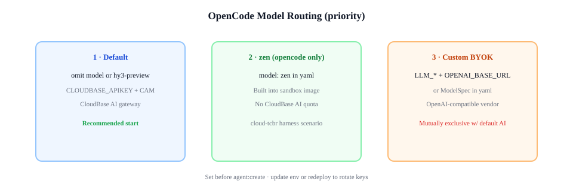

# 沙箱内 Agent — OpenCode

箱内 **OpenCode** 引擎（`engine: opencode`）。通用流程见 [使用指南](./harness-tutorial.md)。完整字段见 **`agent.harness.yaml.example`**。

---

## 快速开始

```bash
magent login
tcb env use your-env-id
cp agent.harness.yaml.example agent.harness.yaml
```

```bash
magent agent:create \
  --name "my-sandbox-agent" \
  --runtime harness \
  --engine opencode \
  --file ./agent.harness.yaml \
  --code ./packages/agent-runtime

magent run -a "$CLOUDBASE_AGENT_ID" \
  -m "在沙箱里执行 uname -a，把输出原样返回。"
```

---

## 模型



OpenCode 使用 **OpenAI 兼容** Chat Completions。在根字段 `model` 中配置（不在 `sandbox` 下）。

| 方式 | yaml | 说明 |
|------|------|------|
| **平台 AI（推荐）** | 省略 `model` 或 `model: hy3-preview` | `magent login` 后走 CloudBase AI；[购买 Token](https://docs.cloudbase.net/ai/model/openai-sdk-access) |
| **zen** | `model: zen` | 箱内内置，不扣 CloudBase AI 额度 |
| **自有模型** | 见下节 | OpenAI 兼容 endpoint + 自有 Key |

`engine: opencode` 时，`apiBaseUrl` 须为 **OpenAI 兼容** 地址，不能填 Anthropic Messages 兼容地址。

### zen

```yaml
engine: opencode
model: zen
```

`magent agent:update -f ./agent.harness.yaml -a "$CLOUDBASE_AGENT_ID"`

---

## 自定义模型（OpenAI 兼容）

在 `agent.harness.yaml` 中配置：

```yaml
engine: opencode
model:
  id: <模型 ID>
  apiKey: <API Key>
  apiBaseUrl: https://<你的域名>/v1
```

`apiBaseUrl` 为 OpenAI 兼容根地址（可带 `/v1` 后缀）。更换 Key 或 endpoint 后执行 `magent agent:update -f ./agent.harness.yaml`。

---

## 其它能力

bash、自定义工具、MCP、Skills、COS、自定义镜像见 [使用指南](./harness-tutorial.md)。

---

## 常见问题

| 现象 | 处理 |
|------|------|
| 首条消息超时 | 等待沙箱预热 |
| 模型 401 / 403 | 检查 API Key 与控制台 AI 开关 |
| 想用 Claude Code | [harness-claude-code.md](./harness-claude-code.md) |

---

## 相关文档

- [使用指南](./harness-tutorial.md)
- [Claude Code](./harness-claude-code.md)
- [配置模板](../agent.harness.yaml.example)
