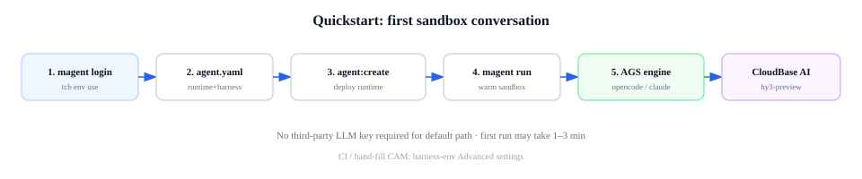

# 沙箱内 Agent 使用指南

在 [README 快速开始](../README.md) 基础上，部署并在 **远程沙箱**里运行 OpenCode 或 Claude Code（`runtime: harness`）。

| | 托管 Agent（默认） | 沙箱内 Agent |
|---|-------------------|--------------|
| 执行位置 | 网关 Runtime | 远程沙箱内的 engine |
| 适合 | 轻量对话、MCP | bash、改文件、完整编码环境 |
| 配置 | 省略 `runtime` | `runtime: harness` + `engine: opencode` 或 `claude` |

**选型：** [Harness 用户故事](./harness-user-story.md)（Harness 运行时 vs MA HTTP 两条路径）  
**按引擎：** [OpenCode](./harness-opencode.md) · [Claude Code](./harness-claude-code.md)  
**按 MA HTTP 协议：** [Managed Agents 使用指南](./managed-agents-guide.md)


---

## 开始之前

1. Node ≥ 20；`magent login` → `tcb env use <envId>`（与全局 `tcb` 共用 `~/.config/.cloudbase/`）。
2. 环境已开通 **AGS 沙箱**、**CloudBase AI**（默认模型 `hy3-preview`）。
3. **不必**在控制台创建 API Key，也不必先 export 四列 CloudBase 变量 — 见 [凭证说明](./harness-credentials.md)。

部署使用 **`agent.yaml` + `magent`**。凭证默认走 CLI，见 [harness-credentials.md](./harness-credentials.md)；CI / 手填见 [harness-env — Advanced settings](./harness-env.md#advanced-settings)。

---

## 用户故事：从零到第一次对话

目标：用 **CloudBase AI 默认模型** 跑通一条命令，**无需**第三方 LLM Key，**无需** COS。



### 1. 登录并选环境

```bash
magent login
tcb env use your-env-id
```

不必手填 `TCB_SECRET_*`、`CLOUDBASE_ENV_ID`、`TCB_REGION`；`magent agent:create` 部署时会从 CLI 解析并写入云上函数 env。  
CI 或无 tcb 交互机器见 [Advanced settings](./harness-env.md#advanced-settings)。

> 不必去控制台单独创建 **API Key**；Runtime 会用 CAM 自动换网关令牌。

### 2. 编写 `agent.yaml`

```bash
cp docs/examples/agent.sandbox.opencode.min.yaml ./agent.sandbox.yaml
# agent.sandbox.yaml 为本地工作副本（已 gitignore），勿 commit
```

```yaml
name: My Sandbox Agent
runtime: harness
engine: opencode
system: |
  You are a helpful coding assistant in a remote sandbox workspace.
```

使用 **Claude Code** 时：换 [agent.sandbox.claude.min.yaml](./examples/agent.sandbox.claude.min.yaml)，`engine: claude`，见 [harness-claude-code.md](./harness-claude-code.md)。

### 3. 部署

```bash
npm run build

magent agent:create \
  --name "myagent" \
  --runtime harness \
  --engine opencode \
  --file ./agent.sandbox.yaml \
  --code ./packages/agent-runtime
```

- 默认云函数，约 1–2 分钟就绪（`magent agent:get` 显示 Ready 后再 `run`）；`--name` 宜短（过长可能 alias 失败）。生产推荐 `--type tcbr`（见 [product-guide](./product-guide.md)）。
- 若报错与 **RoleArn / 沙箱工具** 有关，见下文 [首次起箱](#首次起箱沙箱工具与-rolearn)。

```bash
export CLOUDBASE_AGENT_ID=agent-my-sandbox-agent-xxxxxx
magent agent:get -i "$CLOUDBASE_AGENT_ID"
```

### 4. 对话

```bash
magent run -a "$CLOUDBASE_AGENT_ID" \
  -m "在沙箱里执行 uname -a，把输出原样返回。"
```

首次可能显示 `Warming sandbox...`，等待 1–3 分钟。

### 5. 用 SDK（可选）

```typescript
import ManagedAgents from "open-managed-agent-sdk";

const client = new ManagedAgents({
  envId: process.env.CLOUDBASE_ENV_ID!,
  agentId: process.env.CLOUDBASE_AGENT_ID!,
  // 推荐先用 magent run（自动 CAM 鉴权）；纯 SDK 见 product-guide
});

const session = await client.sessions.create({ title: "sandbox-demo" });
for await (const event of client.sessions.prompt(session.id, "列出当前工作目录下的文件。")) {
  if (event.type === "chunk") process.stdout.write(event.text);
}
```

### 6. 自定义数据面镜像（可选）

默认使用平台沙箱镜像，**快速开始不必改**。

若需预装依赖或 starter 工程：

1. 说明：[tcb-remote-workspace](https://github.com/RealAlexandreAI/tcb-remote-workspace) · 镜像包 [pkgs/container/tcb-remote-workspace](https://github.com/RealAlexandreAI/tcb-remote-workspace/pkgs/container/tcb-remote-workspace)（GHCR 仅作**参考构建源**）
2. `docker pull ghcr.io/realalexandreai/tcb-remote-workspace:<tag>` → `FROM` 扩展 → `docker build`
3. **推到腾讯云 TCR**（个人版 / 企业版），且与沙箱环境**同地域**；AGS 侧一般**不支持**直接填 `ghcr.io/...`
4. 部署前指定 **TCR** 镜像地址（二选一）：

```bash
# 方式 A：部署前 export（magent 不自动读 .env.harness）
export HARNESS_SANDBOX_IMAGE=ccr.ccs.tencentyun.com/<命名空间>/<镜像>:<tag>
magent agent:create --runtime harness ...
```

或在 `agent.yaml` 写 `sandbox.image: ccr.ccs.tencentyun.com/...`（与 export 等价，写入 Runtime env）。

企业版 TCR 时另设 `export HARNESS_SANDBOX_IMAGE_REGISTRY_TYPE=enterprise`（个人版默认 `personal`，可不写）。

5. **换镜像 tag** 后：用**同一组** `export` 再执行 `magent agent:update -f ./agent.sandbox.yaml -a <agentId>`，下次起箱时 Runtime 会把新地址同步到 AGS Tool。

首次创 AGS 沙箱工具时，`HARNESS_TOOL_ROLE_ARN` 需能拉取该 TCR 仓库（通常关联 `QcloudTCRReadOnlyAccess`），见 [凭证说明 · CAM 角色](./harness-credentials.md#首次创沙箱工具cam-角色harvestool_role_arn)。

> 研发验收可把 ④ 写在 `.env.harness`，但须先 `node scripts/harness/load-env.mjs` 注入进程 env，再 `magent agent:create`；日常对客部署用方式 A 即可。

---

## 用户故事：选择模型

同一套部署方式，按需求调整模型即可。

| 你想… | 做法 | 适用引擎 |
|--------|------|----------|
| 用 CloudBase 模型（推荐起步） | 省略 `model` 或写 `hy3-preview`（需 CAM）；体验额度用完后可在控制台 [购买 Token 资源包](https://docs.cloudbase.net/ai/model/openai-sdk-access) | opencode、claude |
| 不消耗 CloudBase AI 额度 | `model: zen` | **仅 opencode** |
| 用自己的 LLM 厂商 Key | 部署前 export `LLM_*`，或 yaml 里写 ModelSpec（与上表 CloudBase Token **二选一**） | 见下方与引擎专篇 |

改完后：

```bash
magent agent:update -f ./agent.sandbox.yaml -i "$CLOUDBASE_AGENT_ID"
```

**OpenCode — 第三方 OpenAI 兼容（如 NVIDIA）：**

```bash
export LLM_API_KEY=your-api-key
export LLM_MODEL=moonshotai/kimi-k2.6
export OPENAI_BASE_URL=https://integrate.api.nvidia.com/v1
magent agent:create ...   # 已部署的 Agent 改 Key：重新 create 或在控制台改该函数的环境变量
```

**Claude Code — 默认仍走 CloudBase AI**（[Anthropic 协议兼容](https://docs.cloudbase.net/ai/model/anthropic-sdk-access)）。第三方 Anthropic 兼容服务：

```bash
export LLM_API_KEY=your-api-key
export LLM_MODEL=your-model-id
export ANTHROPIC_BASE_URL=https://your-endpoint/anthropic
```

细节：[harness-opencode.md](./harness-opencode.md) · [harness-claude-code.md](./harness-claude-code.md)

---

## 用户故事：能力进阶

在能对话之后，按需叠加（`magent agent:update -f ./agent.sandbox.yaml`）。

| 步骤 | 能力 | 说明 |
|------|------|------|
| [工具](#沙箱工具) | bash、读写文件 | `agent_toolset` |
| [自定义工具](#自定义工具) | 客户端执行逻辑 | `type: custom` + SDK 回调 |
| [MCP](#外部-mcp) | 接 GitHub 等远程 MCP | `mcp_servers` + `mcp_toolset` |
| [Skills](#skills) | 领域知识文件 | 物化到沙箱 `.agents/skills/` |
| [审批](#工具审批) | bash 等需用户确认 | `permission_policy: always_ask` |

---

## 首次起箱：沙箱工具与 RoleArn

**部署前自检（推荐）：**

```bash
magent login && tcb env use <envId>
node scripts/check-harness-ready.mjs
```

脚本会告诉你：是否已登录、环境里有没有 `oma-harness-<envId>`、缺不缺 `HARNESS_TOOL_ROLE_ARN`。  
`magent agent:create --runtime harness` 会做**同一套检查**，缺 RoleArn 时**直接拒绝部署**，不会拖到第一次 `magent run`。

**不需要 RoleArn：** `tcb sandbox tool list` 里已有 `oma-harness-<envId>`（或已 pin `HARNESS_TOOL_ID`）。

**需要 RoleArn：** 本环境第一次自动创建沙箱工具。在 `agent:create` **之前**：

```bash
export HARNESS_TOOL_ROLE_ARN='qcs::cam::uin/<uin>:roleName/<角色名>'
```

**角色从哪来：** 见 [harness-credentials.md · 控制台逐步操作](./harness-credentials.md#控制台逐步操作照填)（CAM 每一步填什么、链到哪）。

要点：

- `HARNESS_TOOL_ROLE_ARN` = 沙箱**拉镜像 / 挂 COS** 的执行身份，≠ 云函数角色，≠ `magent login` 的 CAM。
- 服务相关角色 `AGS_QCSLinkedRoleInSandboxTool` **不用你配**。
- 自动创建的工具名：**`oma-harness-<环境 ID>`**。

---

## 进阶

### 自定义沙箱镜像

见上文 [自定义数据面镜像（可选）](#6-自定义数据面镜像可选)。镜像构建与 entrypoint 约定以 [tcb-remote-workspace](https://github.com/RealAlexandreAI/tcb-remote-workspace) 为准。

### 工作区持久化（COS）

**默认：** 多轮对话靠平台会话与同步能力恢复；沙箱里写的文件会随实例回收而丢失。

**启用 COS：** 把项目目录挂到对象存储，会话结束时可快照，下次起箱恢复现场（适合长周期编码任务）。

在 `magent agent:create` 前配置（会写入 Runtime 环境变量）：

```bash
export HARNESS_COS_ENABLED=1
export HARNESS_COS_BUCKET=your-bucket-appid
export HARNESS_COS_BUCKET_PATH=/your/prefix
export HARNESS_COS_ENDPOINT=your-bucket.cos.ap-shanghai.myqcloud.com
export HARNESS_COS_REGION=ap-shanghai
export HARNESS_COS_MOUNT_NAME=ags-cos-workspace    # 与 AGS 工具挂载名一致
export HARNESS_COS_MOUNT_DIR=/mnt/workspace
```

需已在 AGS 沙箱工具上配置好同名 **StorageMount**。首次启用建议与运维确认桶路径与 CAM 权限。

### 导出与回写配置

```bash
magent agent:export -i "$CLOUDBASE_AGENT_ID" -o ./agent.sandbox.yaml
# 编辑后
magent agent:update -f ./agent.sandbox.yaml -i "$CLOUDBASE_AGENT_ID"
```

---

## 运行时结构

见 [架构参考 · Runtime Stack](./harness-architecture.md)（`harness-runtime-stack.svg`）。

`magent agent:update` 改配置约数十秒；**Runtime 代码**变更需重新 `agent:create` 或按 [README](../README.md) 部署章节更新代码包。

---

## 沙箱工具

```yaml
tools:
  - type: agent_toolset
    default_config:
      enabled: true
      permission_policy:
        type: always_allow
    configs:
      - name: bash
        permission_policy:
          type: always_ask
```

---

## 自定义工具

```yaml
tools:
  - type: custom
    name: query_database
    description: Run a read-only SQL query
    input_schema:
      type: object
      properties:
        sql: { type: string }
      required: [sql]
```

由 SDK 在客户端执行，协议与托管 Agent 相同。

---

## 外部 MCP

```yaml
mcp_servers:
  - type: url
    name: github
    url: https://api.githubcopilot.com/mcp/

tools:
  - type: mcp_toolset
    mcp_server_name: github
    default_config:
      permission_policy:
        type: always_allow
```

---

## Skills

```yaml
skills:
  - name: code-review
    description: Code review checklist
    source: ./skills/code-review.md
```

随 `agent:update` 或代码包发布。

---

## 工具审批

```yaml
tools:
  - type: agent_toolset
    configs:
      - name: bash
        permission_policy:
          type: always_ask
```

SDK 流式事件中出现审批请求，确认后继续。

---

## CloudBase 箱内能力

已 `magent login`（或部署时带有效 CAM）时，沙箱启动后会初始化 **CloudBase MCP**（数据库、云函数等），yaml 通常无需额外声明。

---

## 常见问题

| 现象 | 处理 |
|------|------|
| 首条消息超时 | 等待沙箱预热；重试 `magent run` |
| `MISSING_CREDENTIALS` | `magent login`；CI 见 [Advanced settings](./harness-env.md#advanced-settings) |
| 沙箱无法启动 | `magent login` + `tcb env use`、AGS 是否开通、RoleArn（见 [首次起箱](#首次起箱沙箱工具与-rolearn)） |
| 模型 401 / 额度 | 控制台检查 AI 模型开关与 Token 包 |
| 不想用 CloudBase AI 额度 | opencode：`model: zen` |
| 第三方 LLM | 见 [选择模型](#用户故事选择模型) |
| 起箱报 RoleArn / 工具错误 | 见 [首次起箱](#首次起箱沙箱工具与-rolearn) |
| yaml 改了不生效 | `magent agent:update -f ...` |

---

## 相关文档

- [README](../README.md)
- [harness-opencode.md](./harness-opencode.md)
- [harness-claude-code.md](./harness-claude-code.md)
- [harness-env.md — Advanced settings](./harness-env.md#advanced-settings)（CI / 手填 CloudBase 变量）
- [product-guide.md](./product-guide.md)
- [架构参考](./harness-architecture.md)（进阶 / 运维可选）
