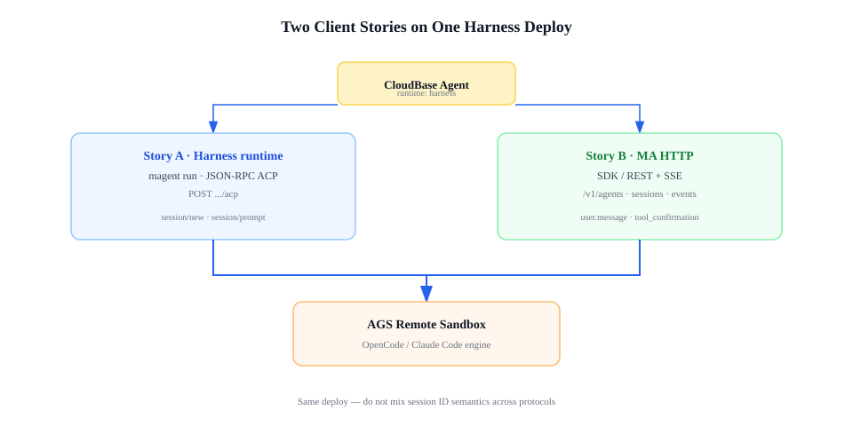

# Harness 用户故事

> 帮你选路：**命令行试跑** 还是 **HTTP API 集成**。  
> 部署步骤见 [使用指南](./harness-tutorial.md)；HTTP 细节见 [Managed Agents 使用指南](./managed-agents-guide.md)。

同一份沙箱 Agent 部署（`runtime: harness`）上，可以走 **两种接入方式**。它们面向不同角色，可以并存，但请各自使用对应的协议，不要混用会话 ID 规则。

---

## 先选故事，再读文档

| 你的情况 | 读哪篇 |
|----------|--------|
| 我要在沙箱里跑编码 Agent，用 CLI 或 IDE 插件 | **故事 A** → [使用指南](./harness-tutorial.md) |
| 我的应用要按 Managed Agents 文档发 HTTP、收 SSE | **故事 B** → [managed-agents-guide.md](./managed-agents-guide.md) |
| 还不确定 | 读完下面两个「我是谁」 |

**不适用本文：** 默认「托管 Agent」（省略 `runtime`）— 无远程沙箱，见 [README 快速开始](../README.md)。

---

## 故事 A：命令行与 ACP 客户端

### 我是谁

- 开发者或运维，想尽快在**远程沙箱**里跑 OpenCode 或 Claude Code。
- 习惯 `magent run`、或已有 **ACP** 兼容客户端（部分 IDE 插件、内部工具链）。
- 不需要自己实现 REST 资源模型。

### 我要什么

- 沙箱里能 bash、读写项目、完成编码任务。
- 用 CloudBase 登录鉴权，不必手搓网关 Token。
- 可选：对象存储工作区、自定义模型、切换 `engine: opencode` / `claude`。

### 典型一天

1. `magent login` → `tcb env use <环境 ID>`  
2. 按 [使用指南](./harness-tutorial.md) 部署；记下 `CLOUDBASE_AGENT_ID`  
3. `magent run -a <agent-id> -m "..."` — 首次可能等待沙箱预热 1–3 分钟  
4. `magent repl -a <agent-id>` — 多轮编码  
5. 换模型、工具、COS 等 — 按指南 [渐进路线](./harness-tutorial.md#学完快速开始之后渐进路线) 逐项叠加

### 我不会做的事

- 把 Anthropic 官方云 endpoint 指到这台 Agent（那是另一套产品）。
- 在同一次集成里混用 ACP 与 MA HTTP 的会话 ID 语义。

### 下一步

| 文档 | 内容 |
|------|------|
| [harness-tutorial.md](./harness-tutorial.md) | 从零部署、第一次对话 |
| [harness-opencode.md](./harness-opencode.md) / [harness-claude-code.md](./harness-claude-code.md) | 按引擎配置模型 |
| [harness-credentials.md](./harness-credentials.md) | 登录、RoleArn、CI |

---

## 故事 B：Managed Agents HTTP

### 我是谁

- 应用后端、自动化平台，或已按 [Anthropic Managed Agents](https://platform.claude.com/docs/en/managed-agents) 写过客户端的团队。
- 需要 **REST + SSE**：创建 Session、订阅事件、发送消息、处理人工确认（HITL）。
- 希望用 `open-managed-agent-sdk` 或自研 HTTP，而不是嵌 ACP。

### 我要什么

- 与官方 MA **协议形状**对齐的路径与事件类型；鉴权换成 **CloudBase Bearer（CAM）**。
- 执行仍在**你的 CloudBase 环境内的远程沙箱**，不是 Anthropic 公有云。

### 典型一天

1. 按 [使用指南](./harness-tutorial.md) 部署 `runtime: harness` 的 Agent（与故事 A 同一份部署）  
2. 用 SDK 或 HTTP 创建 Environment / Agent / Session  
3. 先订阅事件流，再发送 `user.message`  
4. 收到空闲状态结束本轮；需要确认时响应工具确认事件  

### 谁能用、谁不能

| 方式 | 结论 |
|------|------|
| `open-managed-agent-sdk` / 自研 HTTP | ✅ |
| 已按 MA 文档写的应用（换 base URL + 鉴权） | ✅ 大部分流程 |
| Anthropic 官方 SDK 默认 endpoint / ant CLI | ✗ |
| `magent run`（ACP） | 另一条路，见故事 A |

协议能力与差异见 [managed-agents-guide.md](./managed-agents-guide.md#协议实现了什么一览)。

### 我不会做的事

- 把默认托管 Agent（`runtime: managed`）当作 MA HTTP 的后端（须 `runtime: harness`）。

### 下一步

| 文档 | 内容 |
|------|------|
| [managed-agents-guide.md](./managed-agents-guide.md) | SDK 示例、端点、对齐表 |
| [harness-tutorial.md](./harness-tutorial.md) | 部署沙箱 Agent（前置条件） |
| [harness-credentials.md](./harness-credentials.md) | 鉴权与 RoleArn |

---

## 两条故事如何并存

- **开发自测** → `magent run`（故事 A）  
- **线上业务** → `/v1/sessions/...`（故事 B）  

同一 Agent 部署可同时服务两种方式；配置以部署时的 `agent.yaml` 为基线，MA 的 Environment / Agent `metadata` 在创建 Session 时参与合并。

---

## 相关文档

- [使用指南](./harness-tutorial.md)
- [Managed Agents HTTP](./managed-agents-guide.md)
- [凭证说明](./harness-credentials.md)
