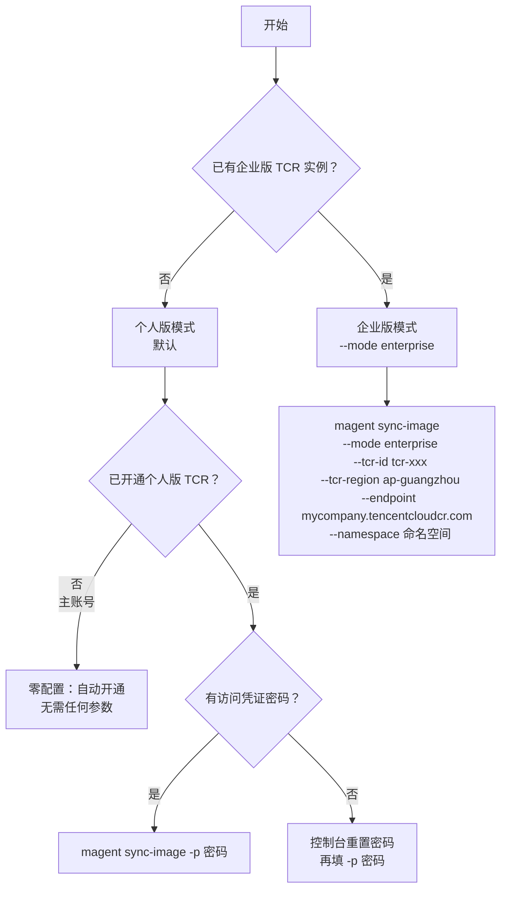

# magent sync-image — 同步镜像到您的容器镜像服务

将预构建的 OpenManagedAgent 和 CloudBase 沙箱镜像同步到您的腾讯云容器镜像服务（TCR）。

## 选择 TCR 模式



---

## 个人版（推荐起步方式）

个人版为腾讯云共享实例，免费，适合个人开发和小团队。

### 首次使用（主账号，从未开通 TCR）

无需任何参数，工具会自动完成 TCR 开通：

```bash
magent sync-image
```

首次运行后，工具会提示将凭证保存到 `.env`，下次可直接零参数运行。

### 已开通 TCR 个人版

```bash
# 提供访问凭证密码
magent sync-image -p <密码>

# 仅同步指定镜像（节约时间）
magent sync-image -p <密码> -i sandbox
```

> **如何获取密码？**
> 访问 [TCR 控制台](https://console.cloud.tencent.com/tcr) → 个人版 → 访问凭证，设置或重置密码。
> 参考：[个人版快速入门](https://cloud.tencent.com/document/product/1141/63910)

### 子账号使用

子账号不具备首次开通权限，需要主账号先完成初始化：

1. 切换到主账号：`tcb login`
2. 完成首次同步初始化：`magent sync-image`
3. 切换回子账号：`tcb login`
4. 提供密码运行：`magent sync-image -p <密码>`

---

## 企业版

企业版为独享实例，需单独购买，适合生产环境和团队协作。

> **前提：** 需先在 TCR 控制台购买企业版实例并完成网络访问策略配置。
> 参考：[企业版快速入门](https://cloud.tencent.com/document/product/1141/39287)

```bash
magent sync-image \
  --mode enterprise \
  --tcr-id tcr-xxxxxxxx \
  --tcr-region ap-guangzhou \
  --endpoint mycompany.tencentcloudcr.com \
  --namespace <命名空间>
```

企业版通过 STS 临时凭证（`CreateInstanceToken`）自动完成登录，**无需提供密码**。

---

## 参数

### 个人版参数（`--mode personal`，默认）

| 参数 | 必填 | 常用 | 说明 | 默认值 |
|------|:----:|:----:|------|--------|
| `-p, --password` | 条件 | ✓ | TCR 访问凭证密码。**已开通 TCR 必填**；从未开通时工具自动初始化，可留空 | 交互询问 |
| `-i, --images` | 否 | ✓ | 同步的镜像：`sandbox`、`tcbr`、`scf`、`all` | `all` |
| `-n, --namespace` | 否 | — | 命名空间，留空自动使用 `tcb-<主账号UIN>` | 自动计算 |
| `--no-save` | 否 | — | 不把凭证写入 `.env`（CI/脚本场景适用） | — |
| `-u, --uin` | 否 | — | 腾讯云 UIN，通常从 `tcb login` 会话自动读取 | 自动检测 |
| `-e, --env-id` | 否 | — | TCB 环境 ID，通常自动检测或交互选择；CI 场景可显式指定 | 自动检测 |
| `--baseline-tag` | 否 | — | 基线镜像版本，默认 `latest`；仅需锁定特定版本时使用 | `latest` |

### 企业版参数（`--mode enterprise`）

| 参数 | 必填 | 常用 | 说明 | 默认值 |
|------|:----:|:----:|------|--------|
| `--mode` | ✓ | ✓ | 固定填 `enterprise` | — |
| `--tcr-id` | ✓ | ✓ | 实例 ID（格式 `tcr-xxxxxxxx`），用于 API 调用 | — |
| `--tcr-region` | ✓ | ✓ | 实例地域（如 `ap-guangzhou`），API 签名必须与实例地域一致 | — |
| `--endpoint` | ✓ | ✓ | 仓库域名（如 `mycompany.tencentcloudcr.com`），用于 `docker login` | — |
| `-n, --namespace` | ✓ | ✓ | 命名空间 | — |
| `-i, --images` | 否 | ✓ | 同步的镜像：`sandbox`、`tcbr`、`scf`、`all` | `all` |
| `--no-save` | 否 | — | 不把配置写入 `.env`（CI/脚本场景适用） | — |
| `-e, --env-id` | 否 | — | TCB 环境 ID，通常自动检测；CI 场景可显式指定 | 自动检测 |
| `--baseline-tag` | 否 | — | 基线镜像版本，默认 `latest` | `latest` |

> **`--tcr-id` 与 `--endpoint` 的区别**
> - `--tcr-id`（`tcr-xxxxxxxx`）：系统生成的实例 ID，仅用于 API 调用（`CreateInstanceToken`）
> - `--endpoint`（`mycompany.tencentcloudcr.com`）：购买时填写的**实例名**决定的域名，用于 `docker login`
>
> 两者不同，无法互推。域名可在 TCR 控制台「实例管理」页的「实例域名」字段查看。

---

## .env 配置

同步成功后，工具会提示保存到 `.env`（仅交互终端；CI/`--no-save` 跳过）。工具首次自动开通 TCR 时也会打印命名空间和 UIN 信息：

```dotenv
TCR_PASSWORD=<访问凭证密码>
TCR_NAMESPACE=tcb-<主账号UIN>   # 可选，默认自动计算
```

企业版推荐用 `.env` 固化参数：

```dotenv
TCR_MODE=enterprise
TCR_INSTANCE_ID=tcr-xxxxxxxx
TCR_REGION=ap-guangzhou
TCR_ENDPOINT=mycompany.tencentcloudcr.com
TCR_NAMESPACE=<命名空间>
```

---

## 镜像说明

| 镜像 | 用途 | 说明 |
|------|------|------|
| `sandbox` | CloudBase 沙箱 | 使用沙箱功能必选 |
| `tcbr` | 云托管（TCBR）| 容器部署 |
| `scf` | 云函数（SCF） | 函数算力部署 |

测试时建议先指定单个镜像（`-i sandbox`）节约时间，最终 all 三个一起同步。

---

## 输出

同步成功后打印完整 TCR 镜像地址（版本号由平台自动生成）：

```
  沙箱  : ccr.ccs.tencentyun.com/tcb-<主账号UIN>/tcb-sandbox:tcb-sandbox-xxxx
  云托管: ccr.ccs.tencentyun.com/tcb-<主账号UIN>/open-managed-agent:open-managed-agent-xxxx
  云函数: ccr.ccs.tencentyun.com/tcb-<主账号UIN>/open-managed-agent:scf-open-managed-agent-xxxx
```

---

## 遇到问题？

| 现象 | 解决方法 |
|------|----------|
| 提示"缺少 TCR 访问凭证密码" | 添加 `-p <密码>` 或在 `.env` 中设置 `TCR_PASSWORD=<密码>` |
| 密码忘记 | TCR 控制台 → 个人版 → 更多 → **重置登录密码** |
| 子账号报错"无 TCR 读权限" | 先用主账号完成初始化，再切回子账号并提供 `-p <密码>` |
| 企业版 `CreateInstanceToken` 失败 | 确认 `--tcr-id`、`--tcr-region` 和 CAM 权限 |
| `docker login unauthorized` | 密码与控制台访问凭证不一致，重置后重试 |
| 构建超时 | 网络问题，重新运行；或联系服务提供方 |

如遇到工具自动处理无法覆盖的情况，可参考官方文档手动完成配置，再回来使用 `-p <密码>` 登录：

- [个人版快速入门](https://cloud.tencent.com/document/product/1141/63910)
- [企业版快速入门](https://cloud.tencent.com/document/product/1141/39287)
