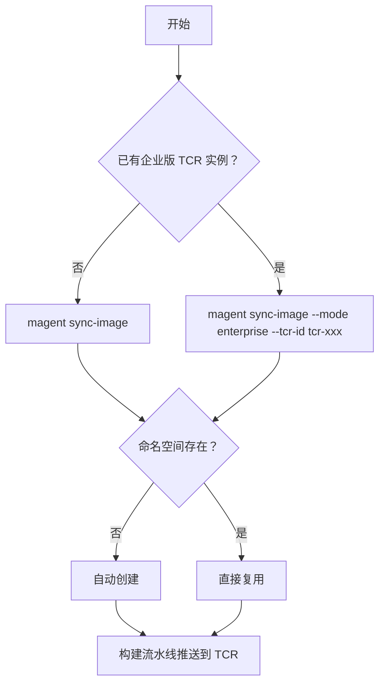

# magent sync-image — 同步镜像到您的容器镜像服务

将预构建的 OpenManagedAgent 和 CloudBase 沙箱镜像同步到您的腾讯云容器镜像服务（TCR）。

一条命令，无需密码。登录和推送由 CloudBase 构建流水线自动完成。

## 选择 TCR 类型



---

## 个人版（推荐起步）

个人版为腾讯云共享实例，免费，适合个人开发和小团队。

```bash
magent sync-image

# 仅同步指定镜像（节约时间）
magent sync-image -i sandbox
```

运行后工具会自动：

1. 检查并开通 TCR 个人版（首次使用时）
2. 准备命名空间（默认 `tcb-<主账号UIN>`：不存在则创建，已存在则复用）
3. 触发 CloudBase 构建，由流水线完成拉取、登录和推送

主账号与子账号使用方式相同，直接运行即可。镜像写入主账号的 TCR 命名空间，开通与推送由构建流水线自动完成。

---

## 命名空间（个人版 / 企业版相同）

| 情况 | 行为 |
|------|------|
| 默认 | 优先使用 `tcb-<主账号UIN>` |
| 默认名已存在 | 直接复用 |
| 默认名不存在，但有 `tcb-<主账号UIN>-*` | 自动复用第一个已有（兼容历史 CloudBase 构建） |
| 都不存在 | 自动创建 `tcb-<主账号UIN>` |
| 手动指定 `--namespace` | 使用指定命名空间，不做自动发现 |
| 数量已满 | 见下方「命名空间已满」 |

#### 命名空间已满

个人版 TCR 可创建的命名空间有限。遇到此情况，请任选以下方式之一：

**方式一：清理不再使用的命名空间**

前往 [TCR 控制台](https://console.cloud.tencent.com/tcr)，删除不再需要的命名空间，然后重新运行：

```bash
magent sync-image
```

**方式二：复用已有的命名空间**

若控制台中已有可用的命名空间，通过 `--namespace` 指定即可：

```bash
magent sync-image --namespace <您的命名空间>
```

也可写入 `.env` 固化：

```dotenv
TCR_NAMESPACE=<您的命名空间>
```

---

## 企业版

企业版为独享实例，需单独购买，适合生产环境和团队协作。

> **前提：** 需先在 [TCR 控制台](https://console.cloud.tencent.com/tcr) 购买企业版实例并完成网络访问策略配置。
> 参考：[企业版快速入门](https://cloud.tencent.com/document/product/1141/39287)

```bash
magent sync-image --mode enterprise --tcr-id tcr-xxxxxxxx
```

运行后工具会自动：查询实例地域与公网域名、准备命名空间与镜像仓库、触发构建并由流水线完成推送。无需手动登录。

`--tcr-region`、`--namespace` 仅在需要覆盖默认行为时使用（例如自动查询失败时手动指定地域）。

---

## 参数

### 个人版（`--mode personal`，默认）

| 参数 | 必填 | 常用 | 说明 | 默认值 |
|------|:----:|:----:|------|--------|
| `-i, --images` | 否 | ✓ | 同步的镜像：`sandbox`、`tcbr`、`scf`、`all` | `all` |
| `-n, --namespace` | 否 | — | 镜像命名空间；留空自动使用 `tcb-<主账号UIN>` | 自动计算 |
| `-e, --env-id` | 否 | — | CloudBase 环境 ID；通常自动检测 | 自动检测 |
| `--baseline-tag` | 否 | — | 基线镜像版本 | `latest` |

### 企业版（`--mode enterprise`）

**必填**

| 参数 | 说明 |
|------|------|
| `--mode enterprise` | 使用企业版 TCR |
| `--tcr-id` | 实例 ID（`tcr-xxxxxxxx`） |

**可选（覆盖默认，平时不用填）**

| 参数 | 说明 | 默认 |
|------|------|------|
| `-i, --images` | 同步的镜像 | `all` |
| `--tcr-region` | 实例所在地域 | 按 `--tcr-id` 自动查询 |
| `-n, --namespace` | 命名空间 | 自动（见上文） |
| `-e, --env-id` | CloudBase 环境 ID | 自动检测 |
| `--baseline-tag` | 基线镜像版本 | `latest` |

---

## .env 配置（可选）

个人版通常无需配置。可选固化命名空间：

```dotenv
TCR_NAMESPACE=tcb-<主账号UIN>
```

企业版也可写入 `.env`，避免每次重复传参：

```dotenv
TCR_MODE=enterprise
TCR_INSTANCE_ID=tcr-xxxxxxxx
# TCR_REGION=ap-guangzhou   # 可选，通常自动查询
```

---

## 镜像说明

| 镜像 | 用途 | 说明 |
|------|------|------|
| `sandbox` | CloudBase 沙箱 | 使用沙箱功能必选 |
| `tcbr` | 云托管 | 容器部署 |
| `scf` | 云函数 | 函数算力部署 |

建议先用 `-i sandbox` 验证流程，再同步全部镜像。

---

## 输出示例

```
  沙箱  : ccr.ccs.tencentyun.com/tcb-<主账号UIN>/tcb-sandbox:tcb-sandbox-xxxx
  云托管: ccr.ccs.tencentyun.com/tcb-<主账号UIN>/open-managed-agent:open-managed-agent-xxxx
  云函数: ccr.ccs.tencentyun.com/tcb-<主账号UIN>/open-managed-agent:scf-open-managed-agent-xxxx
```

---

## 常见问题

| 现象 | 解决方法 |
|------|----------|
| 命名空间数量已达上限 | **方式一**： [TCR 控制台](https://console.cloud.tencent.com/tcr) 删除不再使用的命名空间后重试。**方式二**： `magent sync-image --namespace <您的命名空间>` 复用已有命名空间 |
| 企业版推送失败 | 检查 `--tcr-id` 是否正确；若自动查询地域失败，可手动指定 `--tcr-region` |
| 构建超时 | 稍后重试；持续失败请联系环境管理员 |
| 提示「暂未开通镜像构建能力」 | 需主账号为该 CloudBase 环境开通镜像构建（CloudApp），见下方「前置条件」 |

更多配置可参考腾讯云官方文档：

- [个人版快速入门](https://cloud.tencent.com/document/product/1141/63910)
- [企业版快速入门](https://cloud.tencent.com/document/product/1141/39287)

---

## 前置条件

`magent sync-image` 通过 CloudBase **镜像构建**（CloudApp）完成拉取和推送，与 CloudApp 的权限模型一致：

- 只需环境的**主账号**开通一次镜像构建能力，该环境下所有子账号均可使用
- 您用 `magent login` 登录的可以是主账号或子账号；子账号直接运行 `magent sync-image` 即可
- 请确认：当前登录账号所对应的**主账号**，已为该 CloudBase 环境开通镜像构建

若提示「当前环境暂未开通镜像构建能力」，需由主账号或环境管理员在控制台开通后再试。
